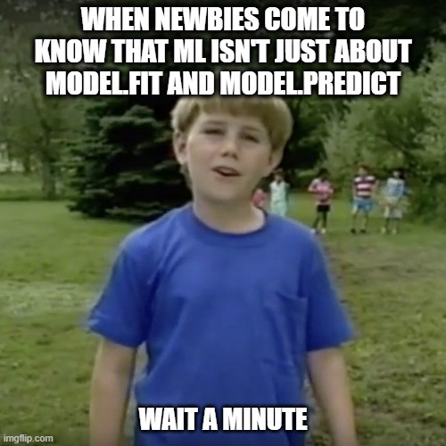

<h1> Machine-Learning-Algorithms-From-Scratch-With-Python </h1>

Hi there 👋  
  this repo is as the title says, I play with the machine learning algorithms and try to implement it to have a good understand of what they actually do. 

<h3>Algorithm Included:</h3>
<ul>
  <li>
  Supervised:
  <ul>
    <li>
  Linear Regression [DONE]🐱‍🏍
    <li>
  Logistic Regression
     <li>
  Decision Tree
     <li>
  Random Forest
     <li>
  Naive Bayes
     <li>
  SVM(Linear, Non Linear)
     <li>
  KNN [DONE] 🐱‍🏍
  </ul>
    <li>
  UnSupervrised
  <ul>
    <li>
  K-Means
    <li>
  Principal Component Analysis
    <li>
  Apriori Algorithm
  </ul>
      <li>
  Deep Learning
  <ul>
    <li>
  Neural Network
    <li>
  CNN(Convolutional Neural Network)
    <li>
  RNN(Recurrent Neural Network) [DONE] 🐱‍🏍
  </ul>
        <li>
  Searching Algorithm
  <li>
  BFS
    <li>
  DFS
</ul>
  
I enjoy watching these series during impleminting the algorithms, it help alot:
<ul>
  <li> https://www.youtube.com/watch?v=rLOyrWV8gmA
  <li>
     https://www.kaggle.com/code/milan400/machine-learning-algorithms-from-scratch
  </ul>
  
  <h4>This Repo is still under progress, so stay tuned 🌡️</h4>
  <h4>Thank you 🚴‍♀️⚡</h4>
  
  

<footer>
  
سُبحانَكَ اللَّهمَّ وبحمدِكَ، أشهدُ أن لا إلَهَ إلَّا أنتَ أستغفرُكَ وأتوبُ إليكَ

</footer>
